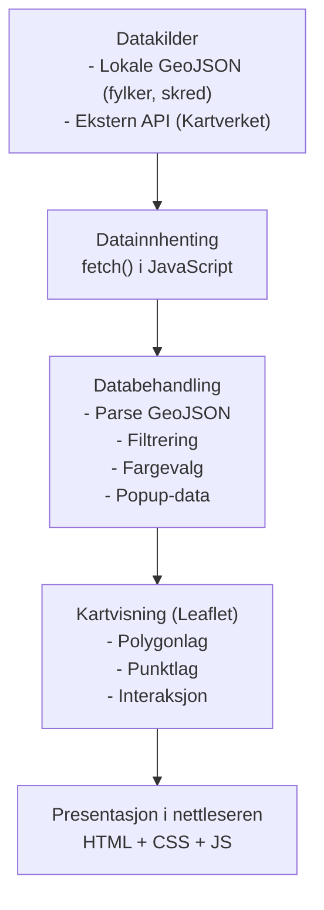

# Oppgave 1 – Webutvikling, GIS, Kartografi

## Endringer siden Canvas-innlevering
Ingen større endringer. Mappestrukturen ble reorganisert for semesteroppgaven.

## Prosjektnavn & TLDR
Kartet vi har laget viser skredfaresoner og fjelltopper i Agder. Det gir viktig informasjon om risiko og sikkerhet, og hjelper til med å unngå områder med skredfare.

## GIF av systemet

## Arkitektur
Applikasjonen består av tre hoveddeler: datakilder, klientlogikk, og presentasjon i nettleseren. Data hentes fra lokale filer og eksterne API-er, behandles i JavaScript, og visualiseres i Leaflet.

## Teknisk stack
1. Applikasjonen er utviklet med Leaflet v1.9.4 som kartbibliotek. Leaflet brukes til å opprette og vise det interaktive kartet, laste inn GeoJSON-filer, håndtere lagkontroll og vise popups.

2. OpenStreetMap (OSM) brukes som bakgrunnskart gjennom Leaflet sin `L.tileLayer()`-funksjon.

3. Kartet viser lokale GeoJSON-filer (`fylker_agder.geojson` og `skred.geojson`) som lastes inn med JavaScript Fetch API.

4. Eksterne data hentes fra Kartverket/GeoNorge sitt Stedsnavn API.

5. Løsningen er bygget med HTML5, CSS3 og moderne JavaScript (ES6).

## Datakatalog

| Datasett | Kilde | Format | Bearbeiding |
|---------|--------|---------|--------------|
| **Fylker i Agder** | `webkart-IS218/data/fylker_agder.geojson` | GeoJSON | Parsed i JavaScript. Polygoner styles basert på fylkesnavn. |
| **Skredhendelser** | `webkart-IS218/data/skred.geojson` | GeoJSON | Parsed og filtrert etter skredtype. Punktlag med popups og fargekoding. |
| **Stedsnavn / Fjelltopper** | Kartverket / GeoNorge API | JSON (API-respons) | Hentes med Fetch API. Filtreres og legges til som eget lag. |
| **Bakgrunnskart** | OpenStreetMap via Leaflet | Rasterfliser | Vises som standard bakgrunnskart. |

## Refleksjoner
Vi kunne brukt mer tid på valg av datasett og planlegging. Diskutert mer med gruppen om hva vi ville utforske. Ble relativt individuell oppgave. Arbeidskravene er utfylt, men vi kunne kommunisert bedre. Dette tar vi med oss videre.
