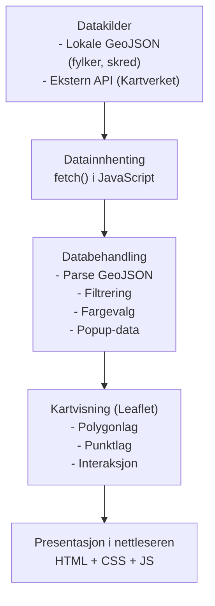

# IS-218 Gruppe 13 – Semesteroppgave

Gruppe 13 sitt repository for IS-218, vårsemesteret 2026.

**Gruppedeltagere:** Emil André Johansen Haraldsø, Herman Berge Hansen, Herman Lonkemoen Haraldsen, Preben Jensen, Truls Næss

---

## 📋 Prosjektoversikt

Dette repositoriet inneholder alle fire oppgavene for semesteret, strukturert som følger:

### [Oppgave 1 – Webutvikling, GIS, Kartografi](Oppgave-1-WebGIS/)
Grunnleggende webkart over Agder med Leaflet, som viser skredfaresoner og fjelltopper.

- **Teknologi:** Leaflet, GeoJSON, OpenStreetMap, JavaScript Fetch API
- **Output:** Interaktivt webkart med GeoJSON-lag og Kartverket API-data

### [Oppgave 2 – GIScience og KI](Oppgave-2-GIScience/)
Utvidelse av oppgave 1 med romlig analyse og spatial database-queries.

- **Del A:** Klientside romlig filtrering (SHIFT+klikk = finn features innen 30 km)
- **Del B:** Spatial queries i Supabase/PostGIS med RPC-funksjoner
- **Teknologi:** Turf.js, PostGIS, Supabase, Python (GeoPandas)

### [Oppgave 3 – Prosjektskisse](Oppgave-3-Prosjektskisse/)
Detaljert skisse for semesterprosjektet.

- **Problemstilling:** Hvordan kan en kartløsning visualisere kriseområder og veilede innbyggere til trygge tilfluktsrom?
- **Tema:** Sivil beredskap og evakuering
- **Datasett:** Tilfluktsrom-data (GML), vegnett, befolkningsdata

### [Oppgave 4 – Semesterprosjekt](Oppgave-4-Semesterprosjekt/)
Implementering av webløsning + rapport basert på prosjektskissen.

- **Status:** Under utvikling
- **Output:** Webapplikasjon + PDF-rapport (maks 10 sider)

---

## 🎯 Løsning

**Problemstilling:** Hvordan kan en kartløsning visualisere kriseområder og veilede innbyggere til trygge tilfluktsrom?

**Løsning (planlagt):**
1. Interaktivt kart som visualiserer kriseområder (bruker tegner polygon/sirkel)
2. Automatisk ruting fra kriseområde til nærmeste tilfluktsrom
3. Visning av tilfluktsrom-informasjon (kapasitet, avstand, kontakt)
4. Spatial database-queries for effektiv søking av ressurser

---

## 🛠️ Teknologi og verktøy

| Lag | Teknologi |
|-----|-----------|
| **Frontend** | HTML5, CSS3, JavaScript (ES6), Leaflet v1.9.4 |
| **Kartbibliotek** | Leaflet, Leaflet Draw, Leaflet Routing Machine |
| **Backend / Database** | Supabase, PostgreSQL, PostGIS |
| **Ruting** | OSRM eller Mapbox Directions API |
| **Datasett** | GeoJSON, GML, Agder-data |
| **Analyse** | Python (Pandas, GeoPandas) |
| **Dataimport** | GDAL/Ogr2Ogr |
| **Versjonskontroll** | Git/GitHub |
| **Utvikling** | VSCode |

---

## 📊 Datasett

| Datasett | Format | Kilde | Oppgave |
|----------|--------|-------|---------|
| Fylker Agder | GeoJSON | Lokal | 1, 2 |
| Skredfaresoner | GeoJSON | Lokal | 1, 2 |
| Fjelltopper | API (Kartverket) | Kartverket | 1 |
| Tilfluktsrom | GML | Agder fylkeskommune | 4 |
| Vegnett | GPKG | Lokal | 4 |

---

## 📚 Dokumentasjon

- **Oppgave 1:** [README.md](Oppgave-1-WebGIS/README.md) – Webkart og GIS-grunnlag
- **Oppgave 2:** [README.md](Oppgave-2-GIScience/README.md) – Spatial analyse og database
- **Oppgave 3:** [README.md](Oppgave-3-Prosjektskisse/README.md) – Prosjektskisse og planer
- **Oppgave 4:** [README.md](Oppgave-4-Semesterprosjekt/README.md) – Semesterprosjekt status

---

## 🚀 Kjøring av webkarten

**Oppgave 1 & 2 (Enkel versjon):**
```bash
cd Oppgave-1-WebGIS/webkart-IS218
# Åpne index.html i en nettleser, f.eks.:
# Kan brukes med enkel HTTP-server:
python -m http.server 8000
# Besøk: http://localhost:8000
```

**Oppgave 4 (Full versjon):**
```bash
cd Oppgave-4-Semesterprosjekt
# TBD – se README.md for instruksjoner når prosjektet er ferdig
```

---

## 📝 Rapport

Den samlede rapporten for mappen skal inneholde:
- README.md + endringsbeskrivelser for oppgave 1, 2, 3
- Semesterprosjekt-rapport (oppgave 4)

Se oppgavebeskrivelsen for krav til format og innhold.

---

## 📞 Kontakt
For spørsmål eller bidrag, se GitHub issues eller kontakt gruppen.

**Sist oppdatert:** April 2026
# IS-218 Gruppe 13 Repository
Gruppe 13 sitt repository for IS-218, vårsemesteret 2026.

# 218-Oppgave-1

## Prosjektnavn & TLDR
Kartet vi har laget viser skredfaresoner og fjelltopper i Agder. Det gir viktig informasjon om risiko og sikkerhet, og hjelper til med å unngå områder med skredfare.

## GIF av systemet


## Arkitektur
Applikasjonen består av tre hoveddeler: datakilder, klientlogikk, og presentasjon i nettleseren. Data hentes fra lokale filer og eksterne API-er, behandles i JavaScript, og visualiseres i Leaflet.



## Teknisk stack
1. Applikasjonen er utviklet med Leaflet v1.9.4 som kartbibliotek. Leaflet brukes til å opprette og vise det interaktive kartet, laste inn GeoJSON-filer, håndtere lagkontroll og vise popups. Biblioteket lastes inn via CDN fra unpkg.com med tilhørende CSS-fil.

2. OpenStreetMap (OSM) brukes som bakgrunnskart gjennom Leaflet sin `L.tileLayer()`-funksjon. OSM leverer kun kartgrunnlaget (kartfliser), mens det er Leaflet som står for selve kartfunksjonaliteten.

3. Kartet viser lokale GeoJSON-filer (`fylker_agder.geojson` og `skred.geojson`) som lastes inn med JavaScript Fetch API. Dataene vises med `L.geoJSON()` og er gjort interaktive med popups og datadrevet styling basert på attributtverdier.

4. Eksterne data hentes fra Kartverket/GeoNorge sitt Stedsnavn API (https://ws.geonorge.no/stedsnavn/v1/navn). Disse dataene behandles i JavaScript og legges til som egne lag i kartet.

5. Løsningen er bygget med HTML5, CSS3 og moderne JavaScript (ES6). Fetch API brukes til å hente data asynkront, og Leaflet håndterer kartvisning, lagstyring og romlig filtrering.

## Datakatalog

| Datasett | Kilde | Format | Bearbeiding |
|---------|--------|---------|--------------|
| **Fylker i Agder** | Lokal fil: `fylker_agder.geojson` | GeoJSON | Parsed i JavaScript. Polygoner styles basert på fylkesnavn. Brukes som bakgrunnslag for regioninndeling. |
| **Skredhendelser** | Lokal fil: `skred.geojson` | GeoJSON | Parsed og filtrert etter skredtype. Punktlag med popups og fargekoding basert på attributter. |
| **Stedsnavn / Fjelltopper** | Kartverket / GeoNorge API: `https://ws.geonorge.no/stedsnavn/v1/navn` | JSON (API-respons) | Hentes med Fetch API. Filtreres til relevante typer (f.eks. fjelltopper). Legges til som eget punktlag i Leaflet. |
| **Bakgrunnskart** | OpenStreetMap via Leaflet TileLayer | Rasterfliser | Ingen bearbeiding. Vises som standard bakgrunnskart. |

## Refleksjoner gjort

Vi kunne brukt mer tid på hva slags dataset vi valgte. Diskutert og engasjert oss mer på hva vi ville utforske med geonorge og utarbeidet en bedre plan med tidsfrister og møter. Ble en veldig inviduell oppgave for de fleste, ettersom vi hadde få møter til å snakke om og utføre prosjektet sammen. Arbeidskravene er utfylt, men samtidig sitter vi igjen med følelsen om at her kan vi legge inn ett bedre arbeid ved å kommunisere bedre. Dette tar vi med oss til neste prosjekt/oppgave.

## Oppgave 2 Del B: Romlig utvidelse

### Beskrivelse av utvidelsen
Vi har lagt til en funksjon i webkartet som lar brukeren finne alle punkter (f.eks. skredhendelser) innenfor en valgfri radius fra et valgt punkt. Radiusen kan endres av brukeren, for eksempel til 30 km, og resultatene oppdateres dynamisk i kartet. Dette gir mulighet for å utforske geografiske sammenhenger og risiko i et område.

### Demo av system
!

### SQL-snippet
Her er SQL-funksjonen som er lagret i Supabase og brukes til å hente alle punkter innenfor valgt radius (kan endres, f.eks. 30 000 meter):

```sql
create or replace function public.get_features_within(
    lat_in double precision,
    lon_in double precision,
    radius_m_in integer
)
returns jsonb
language sql stable as $$
    with q as (
        select
            to_jsonb(t) - 'geom' as props,
            ST_AsGeoJSON(t.geom)::jsonb as geometry,
            ST_Distance(t.geom::geography, ST_SetSRID(ST_MakePoint(lon_in, lat_in), 4326)::geography) as distance_m
        from public.skred_zones t
        where ST_DWithin(
            t.geom::geography,
            ST_SetSRID(ST_MakePoint(lon_in, lat_in), 4326)::geography,
            radius_m_in
        )
    )
    select jsonb_build_object(
        'type','FeatureCollection',
        'features', coalesce(jsonb_agg(
            jsonb_build_object(
                'type','Feature',
                'properties', (q.props || jsonb_build_object('distance_m', round(q.distance_m::numeric,0))),
                'geometry', q.geometry
            )
        ), '[]'::jsonb)
    )
    from q;
$$;
```

### Notebook-guide
Først må du åpne Google colab linken vår:
https://colab.research.google.com/drive/1ey9-2yTEjBSCmVt0VilnBpcoaWCjtvnt?usp=sharing

Vi legger filen i repositoryet også, men du kommer nok til å få problemer til å kjøre det der, siden koden ble skrevet med å hente datasettene fra Google Disk.
Derfor er det viktig at man leser "Koble til Google Drive". Denne gir steg for steg hvordan du skal få tilgang til datasettene.
