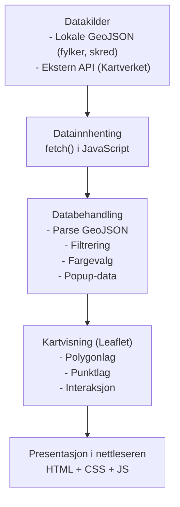

# Webkart - Supabase Spatial SQL Setup

Dette repoet inneholder et Leaflet-basert webkart (`webkart-IS218`) og støttefiler for å koble kartet mot en Supabase/PostGIS database for romlige spørringer (ST_DWithin via en RPC-funksjon).

Kort oversikt over hva jeg la til og hva du må gjøre:

- `webkart-IS218/index.html` og `webkart-IS218/main.js` er oppdatert for å kunne bruke Supabase-klienten (RPC-kall til `get_features_within`).
- `webkart-IS218/supabase-config.js` er en lokal konfigurasjonsfil (skal ikke commites).
- `sql/get_features_within.sql` inneholder SQL for å opprette RPC-funksjonene og en spatial index.
- `scripts/import_skred.sh` er et skript som bruker `ogr2ogr` (GDAL) for å importere `webkart-IS218/data/skred.geojson` til databasen.
- `scripts/test_rpc.sh` er et trygt test-skript som bruker `curl` for å kalle RPC via Supabase REST-endpoint.

## Supabase prosjektref
Fra din lokale `supabase-config.js` ser det ut som prosjektrefen (delen som står foran `.supabase.co`) er:

```
kfdrvyzeknihgkkoqakv
```

Dette betyr at din Supabase-prosjekt-URL er:

```
https://kfdrvyzeknihgkkoqakv.supabase.co
```

Viktig: prosjektrefen er ikke hemmelig. Den brukes i `SUPABASE_URL`.

## Steg-for-steg (raskt)
1. Installer GDAL/ogr2ogr (macOS):

    ```bash
    brew install gdal
    ```

2. Eksporter din DB-tilkobling som en miljøvariabel (sikkert, ikke committ):

    ```bash
    # Eksempel (bytt ut PASSWORD):
    export PG_CONN='host=kfdrvyzeknihgkkoqakv.supabase.co user=postgres dbname=postgres password=Piamia123 port=5432 sslmode=require'
    ```

3. Importer GeoJSON (fra repo-roten):

    ```bash
    chmod +x scripts/import_skred.sh
    ./scripts/import_skred.sh
    ```

4. Åpne Supabase → SQL Editor og lim inn innholdet av `sql/get_features_within.sql`. Kjør scriptet.

    - Hvis du importerte til en annen tabell enn `public.skred_zones`, endre tabellnavnet i SQL-filen før du kjører.

5. Fyll inn `webkart-IS218/supabase-config.js` med `SUPABASE_URL` og `SUPABASE_ANON_KEY` (anon key). Filen er allerede i `.gitignore`.

6. Start en lokal webserver og test:

    ```bash
    python3 -m http.server 8000
    # åpne http://localhost:8000/webkart-IS218/
    ```

7. (Valgfritt) Test RPC direkte fra terminal (ikke dele anon key offentligt):

    ```bash
    # Eksporter disse før test (ikke commit):
    export SUPABASE_URL='https://kfdrvyzeknihgkkoqakv.supabase.co'
    export SUPABASE_ANON_KEY='PASTE_YOUR_ANON_KEY_HERE'
    chmod +x scripts/test_rpc.sh
    ./scripts/test_rpc.sh 59.2 9.6 30000
    ```

## Hva jeg ikke kan gjøre for deg
- Jeg kan ikke kjøre nettverkskommandoer mot din Supabase-konto eller kjøre skript lokalt fra denne miljøet. Du må kjøre `scripts/import_skred.sh` og kjøre SQL i Supabase SQL Editor selv, eller la meg få midlertidig (og sikkert) tilgangsdetaljer hvis du ønsker at jeg skal gjøre eksterne steg (jeg anbefaler å gjøre det selv av sikkerhetsgrunner).

Hvis du vil at jeg utfører et spesifikt repo-endepunkt (for eksempel oppdatere tabellnavn i SQL-filen, eller legge til et eksempel kall i `main.js` for en annen funksjon), si hva jeg skal endre så gjør jeg det.
# 218-Oppgave-1
Gruppe 13 sin repository for oppgave 1 i IS-218

## Prosjektnavn & TLDR
Kartet vi har laget viser skredfaresoner og fjelltopper i Agder. Det gir viktig informasjon om risiko og sikkerhet, og hjelper til med å unngå områder med skredfare.

## GIF av systemet


## Arkitektur
Applikasjonen består av tre hoveddeler: datakilder, klientlogikk, og presentasjon i nettleseren. Data hentes fra lokale filer og eksterne API-er, behandles i JavaScript, og visualiseres i Leaflet.



## Teknisk stack
1. Applikasjonen er utviklet med Leaflet v1.9.4 som kartbibliotek. Leaflet brukes til å opprette og vise det interaktive kartet, laste inn GeoJSON-filer, håndtere lagkontroll og vise popups. Biblioteket lastes inn via CDN fra unpkg.com med tilhørende CSS-fil.

2. OpenStreetMap (OSM) brukes som bakgrunnskart gjennom Leaflet sin `L.tileLayer()`-funksjon. OSM leverer kun kartgrunnlaget (kartfliser), mens det er Leaflet som står for selve kartfunksjonaliteten.

3. Kartet viser lokale GeoJSON-filer (`fylker_agder.geojson` og `skred.geojson`) som lastes inn med JavaScript Fetch API. Dataene vises med `L.geoJSON()` og er gjort interaktive med popups og datadrevet styling basert på attributtverdier.

4. Eksterne data hentes fra Kartverket/GeoNorge sitt Stedsnavn API (https://ws.geonorge.no/stedsnavn/v1/navn). Disse dataene behandles i JavaScript og legges til som egne lag i kartet.

5. Løsningen er bygget med HTML5, CSS3 og moderne JavaScript (ES6). Fetch API brukes til å hente data asynkront, og Leaflet håndterer kartvisning, lagstyring og romlig filtrering.

## Datakatalog

| Datasett | Kilde | Format | Bearbeiding |
|---------|--------|---------|--------------|
| **Fylker i Agder** | Lokal fil: `fylker_agder.geojson` | GeoJSON | Parsed i JavaScript. Polygoner styles basert på fylkesnavn. Brukes som bakgrunnslag for regioninndeling. |
| **Skredhendelser** | Lokal fil: `skred.geojson` | GeoJSON | Parsed og filtrert etter skredtype. Punktlag med popups og fargekoding basert på attributter. |
| **Stedsnavn / Fjelltopper** | Kartverket / GeoNorge API: `https://ws.geonorge.no/stedsnavn/v1/navn` | JSON (API-respons) | Hentes med Fetch API. Filtreres til relevante typer (f.eks. fjelltopper). Legges til som eget punktlag i Leaflet. |
| **Bakgrunnskart** | OpenStreetMap via Leaflet TileLayer | Rasterfliser | Ingen bearbeiding. Vises som standard bakgrunnskart. |

## Refleksjoner gjort

Vi kunne brukt mer tid på hva slags dataset vi valgte. Diskutert og engasjert oss mer på hva vi ville utforske med geonorge og utarbeidet en bedre plan med tidsfrister og møter. Ble en veldig inviduell oppgave for de fleste, ettersom vi hadde få møter til å snakke om og utføre prosjektet sammen. Arbeidskravene er utfylt, men samtidig sitter vi igjen med følelsen om at her kan vi legge inn ett bedre arbeid ved å kommunisere bedre. Dette tar vi med oss til neste prosjekt/oppgave.

## Oppgave 2: Romlig utvidelse

### Beskrivelse av utvidelsen
Vi har lagt til en funksjon i webkartet som lar brukeren finne alle punkter (f.eks. skredhendelser) innenfor en valgfri radius fra et valgt punkt. Radiusen kan endres av brukeren, for eksempel til 30 km, og resultatene oppdateres dynamisk i kartet. Dette gir mulighet for å utforske geografiske sammenhenger og risiko i et område.

### Demo av system


### SQL-snippet
Her er SQL-funksjonen som er lagret i Supabase og brukes til å hente alle punkter innenfor valgt radius (kan endres, f.eks. 30 000 meter):

```sql
create or replace function public.get_features_within(
    lat_in double precision,
    lon_in double precision,
    radius_m_in integer
)
returns jsonb
language sql stable as $$
    with q as (
        select
            to_jsonb(t) - 'geom' as props,
            ST_AsGeoJSON(t.geom)::jsonb as geometry,
            ST_Distance(t.geom::geography, ST_SetSRID(ST_MakePoint(lon_in, lat_in), 4326)::geography) as distance_m
        from public.skred_zones t
        where ST_DWithin(
            t.geom::geography,
            ST_SetSRID(ST_MakePoint(lon_in, lat_in), 4326)::geography,
            radius_m_in
        )
    )
    select jsonb_build_object(
        'type','FeatureCollection',
        'features', coalesce(jsonb_agg(
            jsonb_build_object(
                'type','Feature',
                'properties', (q.props || jsonb_build_object('distance_m', round(q.distance_m::numeric,0))),
                'geometry', q.geometry
            )
        ), '[]'::jsonb)
    )
    from q;
$$;
```

### Notebook-guide
*Legg inn link til notebook her når den er klar.*

